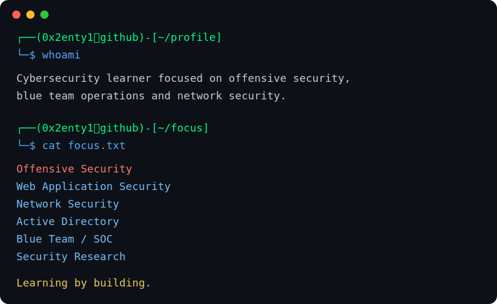

  

---

### 🧠 About

Learning offensive security, blue team and networking by building practical labs and tools.

### 🛠️ Tools & Tech

### 📌 Current Focus

- Offensive Security basics
- Web vulnerabilities
- Networking
- Active Directory
- Blue Team / SOC fundamentals
- Building security tools

### 🚧 Building Soon

- Password Strength Checker
- Phishing URL Checker
- Active Directory Lab
- Network Traffic Analysis Lab
